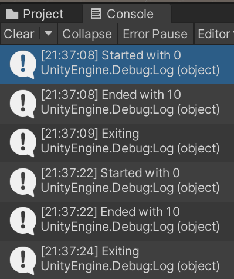

# Domain Reload support through Source Generator
Source Generator to support Domain Reload off in Unity (handle static fields and event handlers).

[MIT LICENSE](./LICENSE) | [CHANGELOG](./CHANGELOG.md)
## Usage
You have two ways to use this repository:
### 1 - Use a release
- Download the latest release from [here](https://github.com/LurkingNinja/DomainReloadSG/releases).
- Extract the DLL file somewhere into your ```Assets``` folder.
- Continue below at the "Finishing" section
### 2 - Build
- Clone the repo
- Open up in your favorite IDE
- Build the solution
- Copy the ```<repo path>\bin\Release\netstandard2.0\DomainReloadSG.dll``` somewhere into your ```Assets``` folder
### Finishing
- Follow the instructions [here](https://docs.unity3d.com/Manual/roslyn-analyzers.html):
> - Inside the Asset Browser, click on the .dll file to open the Plugin Inspector
    window.
> - Go to Select platforms for plugin and disable Any Platform.
> - Go to Include Platforms and disable Editor and Standalone.
> - Go to Asset Labels and open the Asset Labels sub-menu.
> - Create and assign a new label called RoslynAnalyzer. To do this, enter “RoslynAnalyzer” into the text input window in the Asset Labels sub-menu. This label must match exactly and is case sensitive. After you create the label for the first analyzer, The label appears in the Asset Labels sub-menu. You can click on the name of the label in the menu to assign it to other analyzers.

### Limitations
- The class you're augmenting _has to be_ decorated with the ```partial``` keyword.
- Currently there is no way of excluding static fields or methods from this service.
- If you're using extra namespaces currently you need to explicitly write it in the code as opposed of in a ```using``` statement.

### Exclusion
- Decorate your partial class with ```[NoDomainReloadSupport]``` attribute if you want to exclude it completely.

### Example
```csharp
using UnityEngine;

public partial class TestStaticOnNoDomainReload : MonoBehaviour
{

    private static int _number;
    
    private void Start()
    {
        Debug.Log($"Started with {_number}");
        _number += 10;
        Application.quitting += OnQuit;
        Debug.Log($"Ended with {_number}");
    }

    private static void OnQuit() => Debug.Log("Exiting");
}
```
The result after entering play mode twice:



Obviously the ```Edit > Project Settings > Editor > Enter Play Mode``` is set and the ```Reload Domain``` is not set.

The generated source code:
```TestStaticOnNoDomainReload_codegen.cs```
```csharp
using System;
using UnityEngine;

    public partial class TestStaticOnNoDomainReload 
    {
        [UnityEngine.RuntimeInitializeOnLoadMethod(UnityEngine.RuntimeInitializeLoadType.SubsystemRegistration)]
        static void ApplyStaticFieldsAndEventHandlers()
        {
			_number = default;
			Application.quitting -= OnQuit;

        }
    }
```